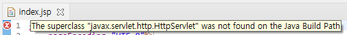
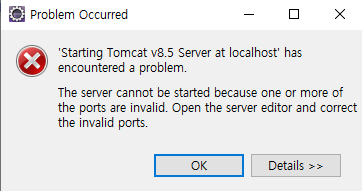

# HTML5 + CSS3 내용 정리

✍️ *Written by JiYoung-Kwon*

<br/>

* 정리되지 않은 내용은 책을 참고!

***

* tomcat 설치 시 주의사항
  1. server port : 8080 -> 8888 (오라클과 충돌)
  2. admin 계정/암호 기억하기
  3. 시작옵션 : 수동

* 이클립스 jsp 생성 시 오류 해결방안

  * 

  * Java Build Path - Libraries - add library - Server Runtime - tomcat 버전 선택 - apply

* 이클립스 톰캣 서버 실행 시 오류
  * 
  * 서버 Open - Overview - Ports - Tomcat admin port의 포트 번호를 임의의 겹치지 않는 포트로 변경

## 1장.

### 1-1. HTML

* HTML (HyperText Markup Language)
  * 하이퍼텍스트 : 웹 사이트에서 링크를 클릭해 다른 문서나 사이트로 즉시 이동할 수 있는 기능
  * 마크업 : 태그를 사용해 문서에서 어느 부분이 제목이고 본문인지, 어느 부분이 사진이고 링크인지 표시하는 것
  * 즉, 웹에서 자유롭게 오갈 수 있는 웹 문서를 만드는 언어
  * **특징**
    1. 대소문자를 구별하지 않음
    2. 두 칸 이상의 공백은 구별하지 않음
       * 띄어쓰기 : `&nbsp;`
    3. 줄바꿈(엔터키)을 인식하지 않음
    4. 큰따옴표, 작은 따옴표를 구분하지 않음
       * 묵시적으로 작은 따옴표를 쓰는 경우가 많음

***

1-2. PASS

***

### 1-3. HTML 기본 문서 구조

* 태그는 <와 >을 이용해 구분
* 태그는 소문자로 사용할 것을 권장
* 여는 태그, 닫는 태그 정확히 입력할 것
* 적당히 들여쓰기 (가독성)
* HTML 문서 기본 구조
  * \<!doctype> : 문서 유형 지정
    * 이제부터 처리할 문서는 HTML 이고, 어떤 유형을 사용할 것이니 알맞게 해석해라
  * \<html> : 웹 문서 시작을 알림
    * lang 속성 : 문서에서 사용할 언어를 지정
      * html -> 전자문서를 만들 경우, 속성 표시를 안하면 한글이 깨질 수 있음
      * `<html lang = "ko">`
    * 
  * \<head> : 브라우저에게 정보를 줌
    * \<title> : 문서 제목
    * \<meta> : 문자 세트를 비롯한 문서 정보
      * `<meta charset = "UTF-8">` : utf-8이라는 문자 세트를 사용한다.
      * 모바일 기기 고려하기
        * 모바일을 고려하지 않을 시, 시장에서 도태될 수 있음
        * 과거 : 풀 브라우징(컴퓨터에서 보이는 웹과 같이 전체적으로 다 보이는 것)
        * 현재 : 반응형 웹이 대세
        * `<meta name = 'viewport' content='width=device-width, initial-scale=1.0'>`
          * viewport를 써주지 않으면 풀 브라우징 기반 -> 글씨가 작게 보일 수 있음
          * device-width : 디바이스가 가진 넓이
          * initial-scale = 1.0 : 확대모드를 1.0으로 설정
  * \<body> : 실제 브라우저에 표시될 내용

<br/>

***

### 1-4. 웹 문서 업로드

* 위 세 가지는 개발자라면 사용할 줄 알아야 함 (한 번쯤은 해볼 것)
  1. 원격 터미널
  2. FTP (FTP 프로그램 중, FileZila를 무료로 사용할 수 있음)
  3. GIT

<br/>

## 2장.

:pushpin: **block 타입**

* 갖고 있는 컨텐츠의 양이 적더라도 남아있는 오른쪽에 다른 요소들이 올 수 없다.

:pushpin: **inline 타입**

* 갖고 있는 컨텐츠의 양만큼만 영역을 차지하면서 남아있는 오른쪽에 다른 요소들을 올 수 있게 한다.

:pushpin: CSS에서는 이 둘의 장점만 갖고 있는 **inline-block** 타입을 지원함

<br/>

***

### 2-1. 블록 형태

* 텍스트를 블록으로 묶어 처리하는 태그

* \<h*n*> : 제목 표시

  * heading의 줄임말 h, 제목 크기를 나타내는 숫자(1~6)

  * \<h1>이 가장 큰 제목, \<h6>이 가장 작은 제목

* \<p> : 단락

* \<br> : 줄 바꿈

* \<hr> : 수평 줄 넣기 -> html5에서는 section을 구분해주는 기능으로 변경

<br/>

***

### 2-2. 인라인 형태

* 줄바꿈 없이 텍스트를 표시

* \<strong> or \<b> : 텍스트를 굵게 표시함
  * strong은 중요함의 의미, b는 단순히 글자를 굵게 표시한다는 의미
* \<em>/\<i> : 텍스트를 비스듬히 이탤릭체로 표시함
* \<q> : 인용한 내용을 표기함. blockquote와 유사하지만 인라인 형태
* \<mark> : 선택한 부분의 배경색이 노란색이 되며 형광펜 효과를 냄
* \<span> : 텍스트 단락에서 줄바꿈없이 일부 텍스트만 묶어 스타일을 적용할 때 사용. 인라인 형태의 묶음
  * 블록 단위로 묶고 싶다면 \<div> 사용

<br/>

***

### 2-3. 목록 태그

* **css의 중첩을 최대한 예방하기 위해서** 보통 body 안에 \<div id= '파일명'>으로 영역 설정
  * id는 하나만 존재해야 함
  * 구체적으로 폴더명_파일명이라고 기술하는 경우도 있음
*  \<ul> : unordered list라는 의미이며, 항목에 기호문자를 붙여줌.
  * type = 'circle' : 속이 빈 동그라미
  * type = 'disc' : 속이 찬 동그라미
  * type = 'square' : 속이 찬 네모
*  \<ol> : ordered list라는 의미이며, 항목에 순서를 나타내는 번호를 붙여줌 		
  * 1 : 기호를 숫자로 나타냄
  * a A : 기호를 알파벳으로 나타냄
  * i I : 기호를 로마자로 나타냄
  * type, start, reversed
* \<dl> : description list라는 의미이며, 제목과 설명을 한 쌍으로 해서 목록으로 보여줌
  *  \<dt> : 제목
  *  \<dd> : 설명

<br/>

***

### 2-4. 표 태그

* \<table>
  * **표로 레이아웃을 만들지 말 것 (왠만하면 표를 나타내는 것에만 사용할 것)**
    * 렌더링 속도가 떨어짐
    * 구조적인 마크업을 해치며 웹접근성 관점에서도 바람직하지 않은 사용 사례
    * 웹 표준 규정에 어긋남
  * \<tr> : 행
  * \<td> : 행마다 셀 만들기 (열)
  * \<th> : 표에 제목 셀 만들기
    * 다른 글자보다 굵게 표시하고, 셀의 중앙에 배치
  * 속성 (그러나, CSS를 권장함)
    * colspan : 열 합치기 (가로)
    * rowspan : 행 합치기 (세로)
    * align : 텍스트 정렬
  * \<caption> : 표 제목 붙이기
  * 표 스타일 지정하기 -> CSS

<br/>

## 3장.

### 3-1. 이미지 태그

* 웹에서 사용하는 이미지 형식
  * GIF : 파일 크기가 작다. 작은 이미지에 주로 사용. 움직이는 이미지 만들 수 있음
  * JPG/JPEG : GIF보다 다양한 색상과 명함 표현 가능. 저장 반복 시 화질 떨어질 수 있음
  * **PNG : 가장 많이 사용. 투명 배경 + 다양한 색상**
* \ : 이미지 삽입
  * src 속성을 사용해 파일 **경로** 를 알려 주어야 함
    1. 절대 경로
       * 경로를 시작할 때 사용되는 기준 위치가 따로 지정되어 있음
         * ex) `localhost:8888/WebStudy/html/table.jsp`
           * 이 웹에서의 절대경로 시작점 : 프로젝트 명
           * 이클립스에서는 WebContent에 웹 관련 요소를 넣기 때문에 이를 WebStudy라고 인식
    2. 상대 경로
       * 현재 프로그램이 실행되고 있는 위치가 기준
       * ./ : 현재 위치로부터 시작
       * ../ : 현재보다 상위 폴더에서 시작
  * 이미지 파일명은 영소문자와 숫자만 사용 권장
    * 한글, 대문자는 비추천
  * 속성
    * alt : 이미지 설명 대체 텍스트
    * width, height : 이미지 크기 조정
      * 크기만 변경. 용량에는 변화가 없음

:pushpin: **참고!** 

* <태그 /> : 시작태그 + 종료
  * ex) \<br/>

:pushpin: **참고!**

* placehold.it
  * 가상 이미지를 띄워주는 사이트
  * 사용 예시 `` 

<br/>

***

### 3-2. 링크

* \<a> 태그

  * 속성
    * href : 링크 주소 입력
    * target : 링크 내용 표시 위치 지정 (현재 창 / 새 창)
      * `target = '이름'` : 최초 새 탭에 열림. 한번 열린 창은 닫히기 전까지 거기서 계속 열림
      * `target = '_blank'` : 무조건 새 탭/새 창에 열림
    * download : 링크 내용을 보여주는 것이 아닌, 다운로드함
      * `download='짱구.jpg'` : 짱구.jpg로 다운로드함

  * 동일 문서 안에서 점프하기
    * \<a href = '#앵커 이름'> ~~ \</a>
      * 클릭 시, \<태그 id = 앵커이름> ~~~ \</태그> 가 걸려있는 곳으로 이동함

* \<map> 태그
  * **img 태그에서 usemap 속성으로 이미지 맵 지정**
    * 이미지 맵 : 한 이미지 상에서 클릭 위치에 따라 서로 다른 링크가 열리는 것
  * \<area> : 영역 표시
    * 속성
      * coords : 영역을 좌표로 지정
      * shape : 영역의 형태를 지정

<br/>

***

3-3. PASS

***

## 4장.

:pushpin:**​ 참고! Get/Post Method**

* get 타입
  * url에 파라미터 값 입력
    * ? : 파라미터의 시작
    * &: 다음 파라미터
  * 길이 제한이 있음
  * 브라우저에 노출이 됨-> 보안 ↓
* post 타입
  * 길이 제한 X
  * 브라우저에 노출 X

### 4-1. 폼(form)

* 사용자가 웹 사이트로 정보를 보낼 수 있는 요소들
* \<form> 태그 : 폼 만들기

  * **form은 중첩해서 사용할 수 없음**
  * 속성
    * method - get/post 결정
    * name - 폼 이름 지정. 구분 위해 사용
      * 이름이 동일하면 배열로 저장됨
    * action : form 태그 안의 내용을 처리해 줄 서버상 프로그램 지정
    * autocomplete : 자동 완성 기능
      * 개인정보와 관련된 처리를 할 때는, 기능을 끄는 것이 좋다.

  * \<input> 태그 : 입력하는 필드 / 버튼 삽입
  * \<lable> 태그 : 폼 요소에 레이블 붙이기
  * \<fieldset> 태그 : 폼 요소 그룹으로 묶기 
    * \<legend> : 묶은 그룹에 제목 붙여줌

<br/>

***

### 4-2. \<input> 태그

* 입력하는 필드 / 버튼 삽입

* 속성 ( type = ' ')

  * radio : 라디오 버튼

    * ```html
      <input type='radio' name='gubun' value='입고'>입고
      ```

    * ◎ 입고 : 글자 클릭 시, 선택 안됨

    * ```html
      <label> <input type='radio' name='gubun' value='출고'>출고</label>
      ```

    * ◎ 출고 : 글자 클릭 시, 선택 됨

    * name을 동일하게 설정해놔야 하나만 선택할 수 있는 라디오 버튼이 됨

  * text : 텍스트 입력 상자

  * search : 검색 상자

  * date : '연, 월, 일' 입력

  * number : 숫자만, 숫자 조절 화살표 포함

  * file : 파일 첨부 버튼

  * submit : 서버 전송 버튼

  * reset : 리셋 버튼

  * password : 비밀번호 -> 입력 시, ●●●● 형식으로 표시됨

  * 등등...

<br/>

***

### 4-3.

* readonly 속성
  * 읽기 전용 필드 만들기

<br/>

***

### 4-4.

* \<textarea> 태그
  * 2칸 이상 공백, 엔터키 => 인식 O
  * HTML 태그를 인식하지 않는다. => 일반 text

<br/>

***

4-5. PASS

***

## 5장.

### 5-1. 스타일

* 형식

  * ```css
    p {text-align: center;}
    선택자 {스타일 속성: 속성 값;} 
    ```

* 세미콜론으로 구분해 중괄호 안에 나열

* 줄 넘김, 들여쓰기 구분 X

  * 가독성을 위해 여러 줄에 걸쳐 작성하는 것이 좋음

* 주석

  * /* 내용 */

* 스타일 적용 방법

  1. 특정 태그에 직접 적용 방법 : **[인라인 스타일]**

     ```html
     <h1 style='color:#ff0000'> INDEX</h1>
     ```

  2. 파일 내부에 작성 방법 : **[내부 스타일 시트]**

     ```html
     <head>
         ...
     	<style>
     		h1{
     			font-family : 궁서체;
     		}
             
     		#index{
     			margin:0 auto;
     			border:1px solid #000000;
     			width:500px
     		}
             
             .cls{
     			text-align:center;
     		}
     	</style>
     </head>
     ```

     * \<head>와 \</head> 태그 안에 \<style> \</style> 작성

  3. 외부 파일에 스타일을 작성한 후 적용하는 방법 : **[외부 스타일 시트]**

     * index.css

     ```css
     @charset "UTF-8";
     
     h1 {
     	font-family: 궁서체;
     }
     
     #index {
     	margin: 0 auto;
     	border: 1px solid #000000;
     	width: 500px
     }
     
     .cls {
     	text-align: center;
     }
     ```

     * index.jsp

     ```html
     <link rel ='stylesheet' type='text/css' href ='./css/index.css'>
     ```

<br/>

***

### 5-2. 선택자

* 전체 선택자 : `* {속성: 속성 값; ...}`
* 태그 선택자 : `태그 { 스타일 }`
* 클래스 선택자 : `.클래스명 { 스타일 }`
* id 선택자 : `#아이디명 { 스타일 }`
* 그룹 선택자 : `이름1, 이름2... { 스타일 }`

+ 참고) tag#id / tag.class	
  + 해당 태그 중에서 ~인 것만 지정할 수 있음
  + `h1.cls {
    	background-color: #ffcccc;
    }`

  * 반대로는 사용할 수 없음 ex) class.tag

+ 참고) 특정 태그 중 속성 지정 : 대괄호

  + `input[type=button]{
    	background-color:#ff0000;
    }`

<br/>

***

### 5-3. 캐스케이딩

* 위에서 아래로 흐르는 스타일 시트
* 두 가지 원칙
  1. 스타일 우선 순위
     * 스타일 규칙의 중요도, 적용범위에 따라 우선 순위 결정, 우선 순위에 따라 스타일 적용됨
  2. 스타일 상속
     * 태그들의 포함 관계에 따라 부모 요소의 스타일을 자식 요소로 전달함

<br/>

***

### 5-4.

* prefix : 브라우저 접두사

  * 특정 브라우저를 지칭하는 것

  * 표준 규약이 아닌 속성들은 브라우저마다 지원하는 방법이 다름

    * 따라서 접두사를 붙여 브라우저별로 구분해주어야 함

  * 호환성을 위해 사용

  * 주로 사용하는 브라우저 접두사 : `-webkit- / -moz- / -o- / -ms `

  * ex) transform 속성  

    * ```css
      .box:hover{
      	-webkit-transform:rotate(15deg);
      	-moz-transform:rotate(15deg);
      	-o-transform:rotate(15deg);
      	-ms-transform:rotate(15deg);
      	transform:rotate(15deg);
      }
      ```

<br/>

***

## 6장.

### 6-1. 글꼴 스타일

* font-family : 글꼴 지정
  * `font-family:궁서체;`
* font-size : 글자 크기 조절
  * 단위 : em, ex, px, pt
* font-weight : 글자 굵기 지정
  * normal / bolder / lighter / 100~900 등...
* font-variant : 작은 대문자로 표시
* font-style : 글자 스타일 지정
  * normal / italic, oblique (이탤릭체)

<br/>

***

### 6-2. 텍스트 스타일

* color : 글자 색 지정
  1. color : red
  2. color : #ff0011 [ff : R, 00 : G, 11: B]
  3. color : rgb(255,0,0);
  4. color : rgba(255,0,0,0.1); -> a : 투명도(0에 가까울 수록 투명)

* text-decoration : 텍스트에 줄 표시하기/없애기
  * none / underline / overline 등
* text-shadow : 텍스트에 그림자 효과 추가
  * none
  * <가로 거리> <세로 거리> <번짐 정도> <색상>
    * ex) `text-shadow:5px 5px 3px #000000;`

***

:pushpin:**​ 참고!**

* [한글입숨](http://hangul.thefron.me/) 사이트
  * **로렘 입숨(Lorem Ipsum)** : 출판이나 그래픽 디자인 분야에서 폰트, 타이포그래피, 레이아웃 같은 그래픽 요소나 시각적 연출을 보여줄 때 사용하는 **표준 채우기 텍스트**
  * **문서에서 텍스트가 보이면 사람들은 전체적인 모양새보다는 텍스트에 담긴 뜻에 집중하는 경향이 있어서** 서체나 디자인을 보일 때 로렘 입숨을 사용
  * 한글판 로렘입숨 - 무의미한 *한글* 텍스트를 생성해 줌

***

* white-space : 공백 처리
  * normal : 여러 공백을 하나로 표시. 기본 값.
  * nowrap : 영역 너비를 넘어가도 줄 바꿈 없이 계속 한 줄로 표시
  * pre-line : 여러 공백을 하나로 표시. 자동 줄 바꿈
  * pre-wrap : 여러 공백을 그대로 표시(인식 O). 자동 줄 바꿈

<br/>

***

### 6-3. 문단 스타일

* direction : 글자 쓰기 방향 지정
* text-align : 텍스트 정렬
* text-justify : 정렬 시 공백 조절(양쪽 정렬)
* text-indent : 텍스트 들여 쓰기(양 조절)
* line-height : 줄 간격 조절 (가독성 높이기)
* text-overflow : 넘치는 텍스트 표기
  * clip : 넘치는 텍스트를 자름
  * ellipsis : 말 줄임표(...)로 잘린 텍스트가 있다고 표시

<br/>

***

### 6-4. 목록 스타일

* list-style-image : 불릿 대신 이미지 넣기

<br/>

***

## 7장.

### 7-1.

* rgb(255,0,0);
* rgba(255,0,0,0.1); -> a : 투명도 (0에 가까울 수록 투명)

<br/>

***

### 7-3. 배경 색, 배경 이미지

* background-color : 배경 색 지정
* background-image : 배경 이미지
  * 파일 경로 : 절대/상대 경로 사용 가능
  * 배경 이미지가 요소 크기보다 작을 경우, 반복되며 채워짐
* background-repeat : 배경 이미지 반복 방법 지정
  * repeat / repeat-x / repeat-y / no-repeat ...
* background-size : 배경 이미지 크기 조절

