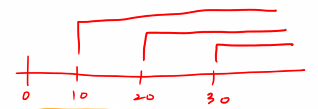

# Oracle 내용 정리

✍️ *Written by JiYoung-Kwon*

<br/>

## 0장.

* 로그인

  * 시스템명 : system
  * 비밀번호 : 내가 설정한 PW

* 기존에는 user 앞에 C##을 붙여서 사용해야 했음

  -> 변경하는 법

  * ```sql
    alter session set "_ORACLE_SCRIPT" = true;
    ```

<br/>

## 1장.

* select는 CRUD의 Read에 해당

* 모든 컬럼 조회

  * ```sql
    SELECT * FROM EMPLOYEES e;
    ```

    * select - 조회
    * \* - 모든 컬럼
    * EMPLOYEES - 테이블명
    * e - 테이블명의 별칭(Alias) 옵션

* 원하는 컬럼 조회

  * ```sql
    SELECT first_name FROM EMPLOYEES;
    ```

* 컬럼 별칭 사용하여 조회

  * ```sql
    SELECT 10 + 10 FROM DUAL;  // 1.
    SELECT 10 + 10 hap FROM DUAL; // 2.
    ```

  * 1. | 10+10 |
       | :---: |
       |  20   |

  * 2. | HAP  |
       | :--: |
       |  20  |
  
* 중복 제거

  * 명령어 : DISTINCT

  * 예시

    * ```sql
      SELECT DISTINCT department_id FROM EMPLOYEES e;
      ```

  * 주의사항

    * ```sql
      SELECT DISTINCT department_id, employee_id FROM EMPLOYEES e ;
      ```

    * 둘이 합쳐서 Unique한 값만 추출 -> 중복 제거 시 주의

      * 1개의 컬럼에만 적어도 모든 컬럼에 적용됨

* 연결연산자

  * ||

    * 자바의 ||과 다르게 쓰이므로 주의할 것

  * ```sql
    SELECT first_name||' 사원의 부서코드는 ' ||DEPARTMENT_ID ||' 입니다.' FROM EMPLOYEES e2; 
    ```

* 원하는 조건만 골라내기

  * WHERE 절 사용

  * 문법

    * ```sql
      SELECT [Column or Expression]
      FROM [Table or View]
      WHERE 원하는 조건;
      ```

    * 순서가 바뀌면 안됨

    * 문자와 날짜를 조회하고 싶은 경우, 반드시 작은따옴표를 붙여야 함

* 다양한 연산자

  * 항상 좌변이 기준

  * BETWEEN a AND b : 사이 범위 값 모두

    * 두 값을 **포함하는** 결과를 출력함
    * BETWEEN 연산자보다 비교 연산자를 쓰는 것을 권장함
      * 속도 면에서 비교 연산자가 더 빠름

  * IN(a,b,c) : A이거나 B이거나 C인 조건

  * LIKE : 특정 패턴을 가지고 있는 조건

    * % : 글자수 제한 X, 어떤 글자가 와도 상관 없음
  * _ : 글자수는 한 글자만 올수 있음, 어떤 글자가 와도 상관 없음
  
  * **IS NULL / IS NOT NULL** 
  
  * 어떤 값인지 '모른다'
    * **관계연산자 = 로 구분할 수 없음!** ex) first_name = null
    * exception이 발생하지 않아, 오류 찾기가 어려움. 주의할 것!
  
* AND
  
    * 논리곱(∩)
    
      * | A    | B    | A and B |
        | ---- | ---- | ------- |
        | 1    | 1    | 1       |
      | 1    | 0    | 0       |
        | 0    | 1    | 0       |
      | 0    | 0    | 0       |
  
* OR
  
    * 논리합(∪)
    
      * | A    | B    | A and B |
        | ---- | ---- | ------- |
        | 1    | 1    | 1       |
      | 1    | 0    | 1       |
        | 0    | 1    | 1       |
        | 0    | 0    | 0       |
  
* 정렬하여 출력

  * ORDER BY 절
    * 오름차순은 ASC, 내림차순은 DESC로 표시
    * DEFAULT는 ASC
    * 정렬에 시간이 많이 걸림 
      * 다른 방법으로는 인덱스를 이용하는 방법이 있음 
      * 하지만, 모든 데이터에 인덱스를 만들었을 시, 오히려 수행속도가 더 걸리는 경우도 있음 (데이터 추가 삭제 시, 인덱스 변경)
      * 따라서, 경우에 따라 적절하게 사용하는 것이 좋음

* 집합 연산자

  * UNION - 두 집합 결과 합쳐서 출력, 중복값 제거, 정렬

  * UNION ALL - 두 집합 결과 합쳐서 출력, 중복값 제거 X, 정렬 X

  * INTERSECT - 교집합 결과 출력 및 정렬

  * MINUS - 차집합 결과 출력 및 정렬. 쿼리 순서 중요

  * ```sql
    SELECT EMPLOYEE_ID ,FIRST_NAME ,SALARY FROM EMPLOYEES e 
    UNION
    SELECT EMPLOYEE_ID ,FIRST_NAME ,SALARY FROM emp;
    ```

<br/>

## 2장.

* 단일행 함수
  * 한 번에 하나씩 처리하는 함수
  * 정리하지 않은 함수들은 책 내용 참고

1. 문자 함수

   * UPPER / LOWER : 전부 대문자/소문자 변환

     * ```sql
       SELECT UPPER(FIRST_NAME),LOWER(LAST_NAME) FROM EMPLOYEES e ;
       ```

   * LENGTH : 길이값 출력

     * ```sql
       SELECT FIRST_NAME 성명, EMAIL 이메일 ,LENGTH(EMAIL) 이메일길이 FROM EMPLOYEES;
       ```

   * CONCAT : 두 문자열 결합해 출력 (||과 동일)

     * ```sql
       SELECT CONCAT(EMAIL,'@korea.com') 이메일 FROM EMPLOYEES
       WHERE DEPARTMENT_ID = 100;
       ```

   * LPAD / RPAD : 왼쪽/오른쪽 특정 문자 채움

     * ```sql
       SELECT FIRST_NAME 성명,LPAD(SALARY,10,'*') 급여 FROM EMPLOYEES e 
       WHERE FIRST_NAME LIKE '%th%';
       //급여를 10자리로 설정, 원래 데이터를 오른쪽에 두고 빈자리는 *로 채움
       //출력 형식 : Timothy | ******2900 
       ```

   * REPLACE : 문자열 치환

     * ```sql
       SELECT FIRST_NAME , REPLACE(FIRST_NAME, SUBSTR(FIRST_NAME,1,2) ,'**') FROM EMPLOYEES e ;
       // 이름의 앞 두자리는 '**'으로 변환하여 조회
       ```

2. 숫자 관련 함수

   * CEIL - 절상. 가장 근접한 큰 정수 출력

   * FLOOR - 절삭. 가장 근접한 작은 정수 출력

     * ```sql
       SELECT FIRST_NAME 성명, SALARY 급여, SALARY *0.1 세금, FLOOR(SALARY+SALARY*0.1) FROM EMPLOYEES e ;
       ```

3. 날짜 관련 함수

   * SYSDATE - 시스템의 현재 날짜와 시간

   * MONTHS_BETWEEN - 두 날짜 사이의 개월 수

     * ```sql
       --29) 본인이 살아온 개월수를 계산
       SELECT MONTHS_BETWEEN(SYSDATE,'1998/04/16') FROM DUAL;
       ```

4. 형 변환 함수

   * TO_CHAR(날짜 -> 문자)
     * 날짜 표현
       * 연도 : RRRR - Y2K 버그로 인해 등장한 연도 4자리 표기법
       * 월 : MM
       * 일 : DD
       * 시간 : HH / HH24
       * 분 : MI
       * 초 : SS
   * TO_CHAR(숫자 -> 문자)
   * TO_NUMBER(문자 -> 숫자)
   * TO_DATE (날짜처럼 생긴 문자 -> 날짜)

5. 일반 함수

   * NVL - NULL 값을 만나면 다른 값으로 치환해서 출력

     * ```sql
       SELECT FIRST_NAME 성명, SALARY 급여, NVL(SALARY *COMMISSION_PCT,0) 보너스
       FROM EMPLOYEES e ;
       ```

   * DECODE - IF문을 ORACLE SQL안으로 가져온 함수

     * ```sql
       SELECT FIRST_NAME ,SALARY, DEPARTMENT_ID, DECODE(DEPARTMENT_ID,100,SALARY*.5,SALARY*.1) 보너스
       FROM EMPLOYEES e2 ;
       ```

   * CASE

     1. ```sql
        -- DECODE문과 유사
        CASE 조건
        	WHEN 결과1 THEN 출력 1
        [	WHEN 결과2 THEN 출력 2
        	...
        	ELSE 기타출력
        ]
        END '컬럼명'
        ```

     2. ```sql
        -- IF와 유사
        CASE
        	WHEN 조건1 THEN 출력 1
        [	WHEN 조건2 THEN 출력 2
        	...
        	ELSE 기타출력
        ]
        END '컬럼명'
        ```

6. 정규식(Regular Expression) 함수

   * 유닉스에서 사용하는 정규식을 사용하여 다양한 검색을 할 수 있음
   * REGEXP_LIKE 함수 - 특정 패턴과 매칭되는 결과를 검색

<br/>

## 3장.

* 복수행 함수(그룹 함수)
  * 여러 건의 데이터를 동시에 입력받아 결괏값 1건을 만들어주는 함수
  * 정리하지 않은 함수들은 책 내용 참고
  * 집계함수
    * count () - 입력되는 데이터의 총 건수를 반환
    * sum() - 입력된 데이터들의 합계 값을 구하는 함수
    * avg() - 입력된 값들의 평균 값을 구해주는 함수
  * GROUP BY 절
    * **유의 사항**
      1. select 절에는 group by 절에서 사용한 컬럼명만 사용 가능
      2. 만약 group by 절에서 사용한 컬럼명이 아닌 경우, 반드시 **집계함수** 내에서 사용해야 함!!

  * HAVING 절
    * 그룹 함수를 비교 조건으로 사용하고 싶을 경우
      * WHERE 절은 그룹 함수를 비교 조건으로 쓸 수 없음

## 4장.

* 정규화 -> 비정규화가 최종목적

  * 비정규화
    * 필요에 따라서 테이블이 쪼개진 상태인데, 성능,사용성 등의 요인으로 다시 두 개 이상의 테이블이 다시 하나로 합쳐지는 상태
  * 정규화
    * 중복데이터를 배제, NULL 값 배제

* 카디션 곱(Cartesian Product)

  * 조인 조건절을 잘못 기술하거나 적지 않을 경우, 해당 테이블에 대한 모든 데이터를 전부 가져오는 현상 
  * 참조되는 테이블 행 수를 모두 곱한 값의 결과가 만들어짐

* EQUI Join (등가 조인) - 기본

  * 선행 테이블에서 데이터를 가져온 후, 조인 조건절을 검사해 동일한 조건을 가진 데이터를 후행 테이블에서 꺼내 오는 방법

* Non-Equi Join (비등가 조인)

  * 서로 틀린 것만 가져오는 것. 잘 사용하지 않음

* **OUTER Join (아우터 조인)**

  * Inner Join : 참여하는 모든 테이블에 데이터가 존재하는 경우에만 결괏값을 출력

  * 한쪽에는 데이터가 있고 한쪽에는 없는 경우, 있는 쪽 내용을 전부 출력

  * ANSI Join 구문 : LEFT OUTER JOIN

  * ```sql
    SELECT d2.DEPARTMENT_ID, DEPARTMENT_NAME, FIRST_NAME 
    FROM DEPARTMENTS d2 LEFT OUTER JOIN EMPLOYEES e2 
    ON d2.DEPARTMENT_ID = e2.DEPARTMENT_ID ;
    ```

* **SELF Join**

  * 자주 사용

  * 원하는 데이터가 하나의 테이블에 다 들어있을 경우

  * ```sql
    SELECT e.first_name, e.EMAIL FROM EMPLOYEES e JOIN EMPLOYEES l
    ON TO_CHAR(e.HIRE_DATE,'RRRR') =  TO_CHAR(l.HIRE_DATE,'RRRR')
    WHERE l.FIRST_NAME = 'Luis';
    ```

<br/>

## 5장.

* **DDL** : Data Definition Language(데이터 정의어)
  * 데이터베이스를 정의하는 언어
  * 오브젝트를 생성, 수정, 삭제하는 등의 데이터의 전체의 골격을 결정하는 역할을 하는 언어
    * 오브젝트 : 오라클 DB 내부에 데이터를 관리하기 위해 생성한 다양한 저장 객체
    * 세그먼트 : 오브젝트 중 특별히 데이터를 저장하기 위한 별도의 저장 공간을 가지는 것

1. CREATE - 새로 생성하라

   ```sql
   * 문법
   CREATE TABLE 테이블명(
   	컬럼명 컬럼유형 옵션,
   	...
   );
   ```

   * 값을 입력하지 않을 경우 자동으로 NULL값이 입력됨
   * 기본 값으로 특정값 지정
     * DEFAULT 특정 값

2. ALTER - 수정,변경

   * 새로운 컬럼 추가 : ADD
   * 테이블 컬럼 이름 변경 : RENAME
     * 번외) 테이블명 변경 `RENAME dept6 TO dept7`
   * 컬럼 유형(데이터 크기) 변경 : MODIFY
   * 컬럼 삭제 : DROP

3. 삭제 명령 비교

   * TRUNCATE : 구조만 남는다.
   * DROP : 남아있는 것이 없다.
   * DELETE : 구조와 데이터가 저장되어 있던 공간만 남는다.

4. Data Dictionary(데이터 딕셔너리)
   
   * 오라클은 DB를 운영하기 위한 정보를 모두 특정 테이블에 모아두고 관리함. 이 테이블

<br/>

## 6장.

* **DML** : Data Manipulation Language(데이터 조작어)
  * 정의된 데이터베이스에 입력된 레코드를 조회하거나 수정하거나 삭제하는 등의 역할을 하는 언어

1. INSERT - 데이터 입력

   * ```sql
     1) INSERT INTO 테이블명(컬럼명1, 컬럼명2, ...) values(값1, 값2, ...);
     2) INSERT INTO 테이블명 values(값1, 값2, ...);
     --모든 컬럼의 순서대로 값을 모두 입력하려 할 때는 테이블명 뒤에 있는 컬럼명을 생략할 수 있다.
     3) INSERT INTO 테이블명 SELECT 절 사용
     4) -- 여러 테이블에 동시에 같은 값을 입력할 때
         INSERT ALL 
     	  INTO 테이블명1 values(컬럼명1, 컬럼명2, ...)
     	  INTO 테이블명2 values(컬럼명1, 컬럼명2, ...)
     	SELECT 절
     ```

2. UPDATE - 데이터 변경

   * ```sql
     1) update 테이블명 set 컬럼명1= 수정값1, 컬럼명2= 수정값2, ... where 조건
     2) update 테이블명 set 컬럼명1= 수정값1, 컬럼명2= 수정값2, ... where 컬럼명=(sub query)
     ```

3.  DELETE - 데이터 삭제

   * ```sql
     delete from 테이블명 where 조건
     ```

4. MERGE - 여러 테이블 데이터 병합

* **TCL** : Transaction Control Language
  * DCL(Data Control Language)에서 트랜잭션을 제어하는 명령인 COMMIT과 ROLLBACK만을 따로 분리해서 TCL이라고 표현
  * COMMIT : 트랜잭션 내의 작업의 결과를 확정하는 명령어
  * ROLLBACK : 트랜잭션 내의 모든 명령어들을 취소하는 명령어

<br/>

## 7장.

* **제약 조건**

  * NOT NULL
  * UNIQUE
  * PRIMARY KEY
  * FOREIGN KEY
  * CHECK

* 테이블 생성 시 지정

  * ```sql
    CREATE TABLE constTest(
    	NO number(4)
    		CONSTRAINT constTest_no_pk PRIMARY KEY,
    	name varchar2(20)
    		CONSTRAINT constTest_name_nn NOT NULL,
    	jumin varchar2(13)
    		CONSTRAINT constTest_jumin_nn NOT NULL
    		CONSTRAINT constTest_jumin_uk UNIQUE,
    	loc_code NUMBER(1)
    		CONSTRAINT constTest_loc_ck CHECK(loc_code<5),
    	deptno NUMBER(6)
    		CONSTRAINT constTest_deptno_fk REFERENCES departments(department_id)
    );
    ```

* 제약 조건 조회

  * ```sql
    SELECT * FROM USER_CONSTRAINTS WHERE TABLE_NAME = 'CONSTTEST';
    -- 조회되지 않는 경우, 다른 스키마에 생성되었을 가능성 존재 
    -- -> ALL_CONSTRAINTS로 확인
    ```

<br/>

## 8장.

* **INDEX**

  * 목적 : 검색을 보다 빠르게 하기 위해
  * primary key, unique 속성을 갖는 컬럼에는 자동으로 index 처리됨
  * **사용조건**
    1. 테이블에 행 수가 많을 경우
    2. where절에 많이 사용되는 컬럼
    3. join에 자주 사용되는 컬럼
    4. null을 포함하는 컬럼이 많은 경우
  * **사용 비추천**
    1. 행 수가 적은 경우
    2. 검색 결과가 10~15% 이상인 경우
    3. DML이 자주 일어나는 경우(insert, update, delete)

  * **종류** 

    1. 고유 index(unique index) : 유일한 값을 갖는 컬럼에 index를 생성하는 경우
    2. 비고유 index(non unique index)
    3. 단일 index(single index) : 하나의 컬럼을 사용하여 index를 생성하는 경우
    4. 결합 index(composite index) : 두 개 이상의 컬럼을 사용하여 index를 생성하는 경우
    5. 함수 index(function base index) : 검색이 되는 컬럼에 연관식이 포함되는 경우

  * **생성 방법**

    1. `create unique index 인덱스명 on 테이블명(컬럼명)`
    2. `create index 인덱스명 on 테이블명(컬럼명)`

    4. `create index 인덱스명 on 테이블명(컬럼명1, 컬럼명2, ...)`
    5. `create index 인덱스명 on 테이블명(salary*100);`

  * index 제거

    * `drop index 인덱스명`

  * index 재구성 : DML이 빈번하게 수행된 경우

    * `alter index 인덱스명 rebuild`

<br/>

## 9장.

* **VIEW (뷰)**
  * 물리적인 테이블을 근거한 논리적인 가상 테이블
  * 실제적인 데이터는 갖고 있지 않다.
  * **목적**
    1. 복잡하고 긴 쿼리문을 뷰로 지정하여 단순화 시킬 수 있다.
    2. 보안에 유리하다.
  * view 생성
    * `create [or replace] view 뷰이름 as select 문장`
  * view 제거
    * `drop view 뷰이름`

<br/>

## 10장.

* Sub Query (서브 쿼리)

  * 쿼리 안에 또 다른 쿼리를 작성하는 형태

  * 서브쿼리는 그 자체적으로 완전한 하나의 실행문이 되어야 한다.

  * 서브쿼리는 () 안에 작성한다.

  * ```sql
    --a) JOIN
    SELECT e2.* FROM EMPLOYEES e2 JOIN DEPARTMENTS d
    ON e2.DEPARTMENT_ID =d.DEPARTMENT_ID 
    WHERE d.DEPARTMENT_NAME ='Sales';
    
    --b) Sub Query
    SELECT * FROM EMPLOYEES e 
    WHERE DEPARTMENT_ID = (SELECT DEPARTMENT_ID 
    					   FROM DEPARTMENTS d2
    					   WHERE DEPARTMENT_NAME = 'Sales');
    ```


* 다중행 서브 쿼리
  * \>ANY : 서브 쿼리 결과 중 최솟값 반환
    * `K>ANY(10,20,30)`
    * 
  * <ANY : 서브 쿼리 결과 중 최댓값 반환
    * `K<ANY(10,20,30)`
    * 
  * <ALL : 서브 쿼리 결과 중 최솟값 반환
    * `K<ALL(10,20,30)`
    * 
  * \>ALL : 서브 쿼리 결과 중 최댓값 반환
    * `K>ALL(10,20,30)`
    * 

<br/>

## 11장.

* SEQUENCE(시퀀스)

  * 중복되지 않는 연속적인 일련번호

  * ```sql
    CREATE SEQUENCE sequence_name
    [INCREMENT BY n] -- 시퀀스 번호 증가값 (default : 1)
    [START WITH n] -- 시퀀스 시작 번호 (default : 1)
    [MAXVALUE n | NOMAXVALUE] -- 생성 시퀀스 최댓값
    [MINVALUE n | NOMINVALUE] -- CYCLE-새로 시작하는 값, 감소하는 시퀀스-최솟값
    [CYCLE | NOCYCLE] -- 시퀀스 번호 순환 사용 여부
    [CACHE n | NOCACHE] -- 시퀀스 생성 속도 개선을 위한 캐싱 여부
    ```

* 시퀀스를 발생 : 시퀀스명.nextval
* 현재 시퀀스 조회 : 시퀀스명.currval
* 목적 : 중복되지 않는 번호를 발생시켜 select와 같은 쿼리문장에서 한건의 데이터를 가져오기 위한 방법

<br/>

## 12장.

* 계층형 쿼리
  * 상하위 관계를 가진 데이터들을 출력할 때, 상하 관계를 표시하기 위해 사용
  * 계층 관계가 보이게 출력하는 쿼리
* 계층형 쿼리와 페이징
  * 

<br/>

***

13,14장은 PASS

***

## 15장.

* PL/SQL

  * 오라클에서 제공하는 프로그래밍 언어

  * 기본 구성

    * Declare(선언부) - 변수/상수 선언
    * Begin(실행부) - 로직 기술
      * DBMS_OUTPUT.PUT_LINE(); - 콘솔모드 출력
    * Exception(예외 처리부) - 예외 처리

  * 변수의 유형

    1) SCALAR 형 : 오라클의 기본 데이터 유형(varchar, NUMBER, char, ...)

    2) %TYPE : 하나의 컬럼 유형을 가져옴

    3) %ROWTYPE : 행 전체의 유형을 가져옴

    4) RECORD TYPE: %ROWTIPE과 유사하나 변수의 요소를 임의로 추가, 삭제할 수 있다.

    5) TABLE TYPE : 하나의 배열과 유사함

  * 조건문

    1. IF문

       * ```plsql
         IF (조건) THEN
         	실행문장;
         END IF;
         ```

       * ```plsql
         IF (조건) THEN
         	실행문장;
         ELSIF (조건) THEN
         	실행문장;
         ELSIF (조건) THEN
         	실행문장;	
         END IF;
         ```

       * ```plsql
         IF (조건) THEN
         	실행문장;
         ELSE (조건)
         	실행문장;	
         END IF;
         ```

    2. CASE 문

       * ```plsql
         CASE [조건]
         	WHEN 조건1 THEN 결과1
         	WHEN 조건2 THEN 결과2
         	...
         [ELSE 기본값]
         END;
         ```

    

